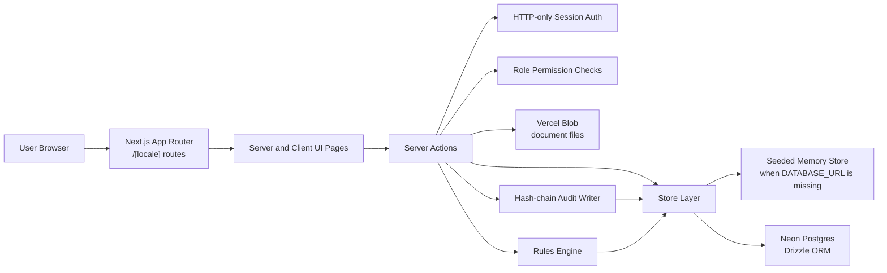
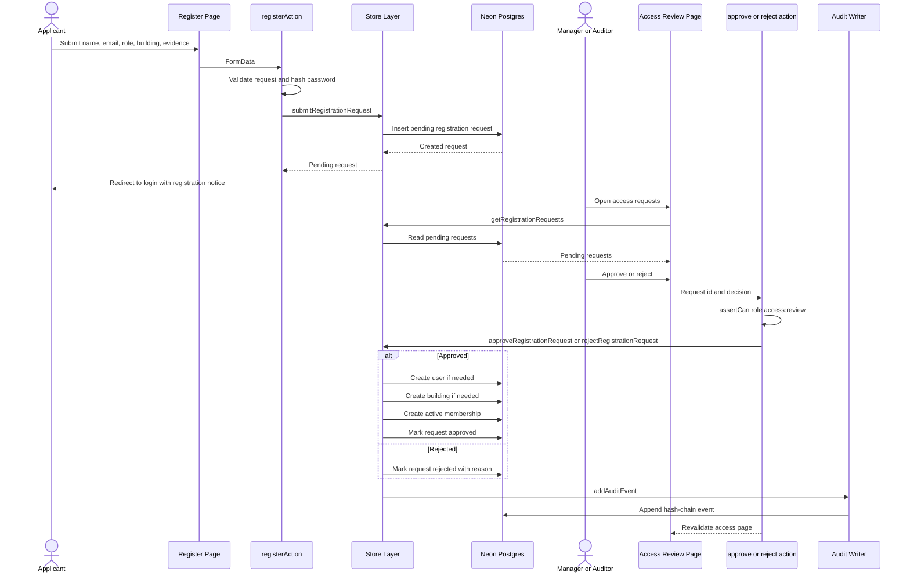
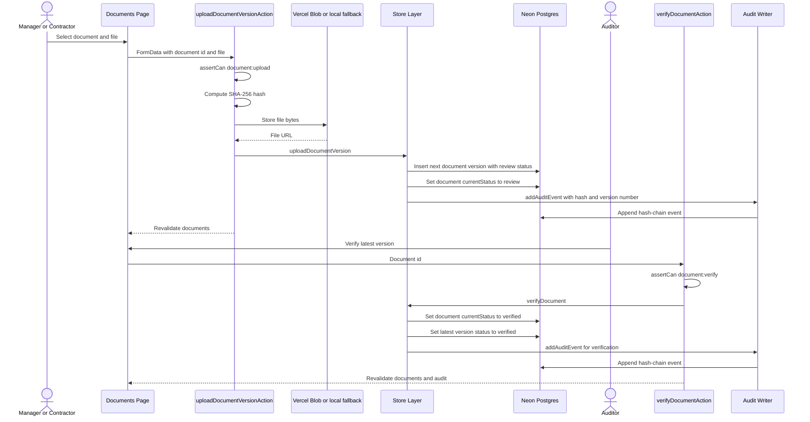
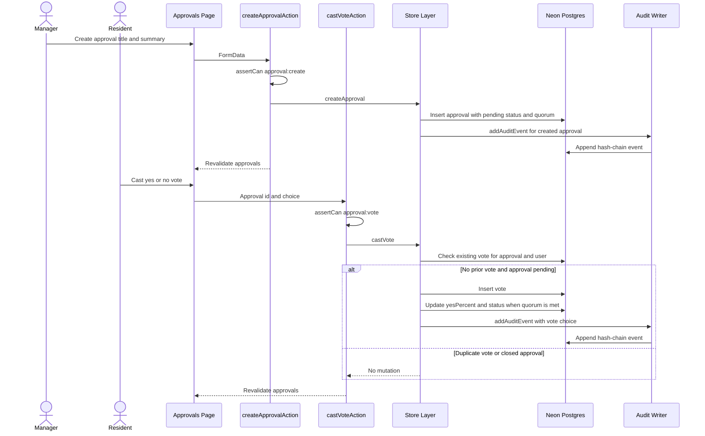
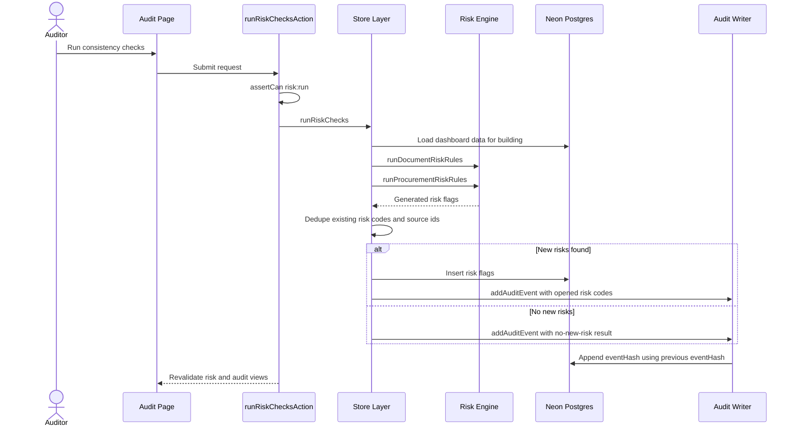
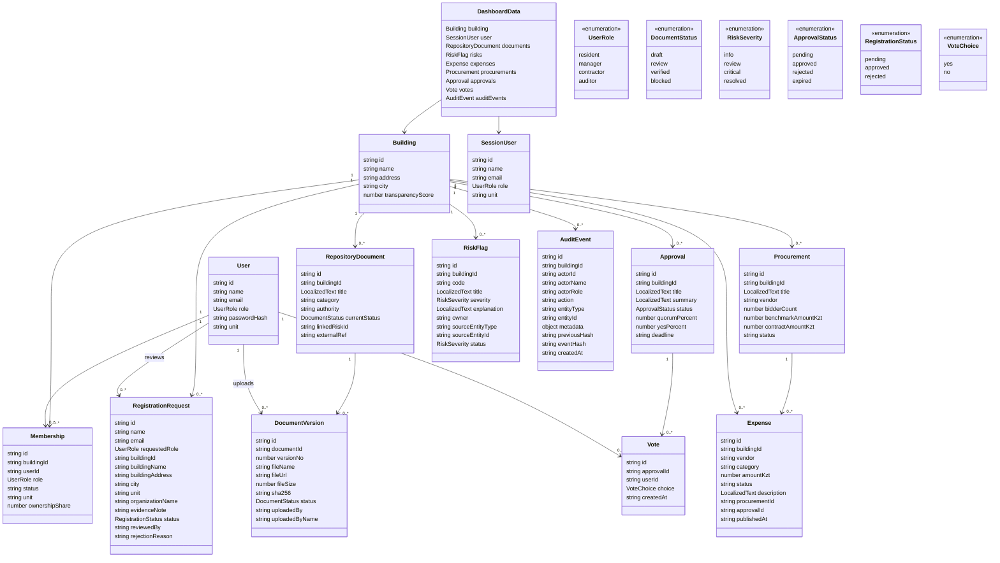
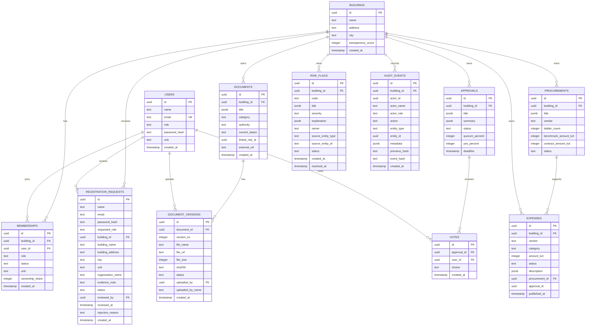

# Shanyraq Architecture Documentation

## Scope

This document describes the current Shanyraq MVP architecture as implemented in the Next.js App Router codebase. It focuses on the application structure that supports one or more apartment complexes, role-based access, document versioning, transparent finance, resident approvals, risk checks, and hash-chain audit events.

The diagrams are aligned with these implementation areas:

| Area | Implementation reference |
| --- | --- |
| Routes | `src/app/[locale]/*` |
| Server actions | `src/app/actions.ts` |
| Domain types | `src/lib/domain.ts` |
| Permissions | `src/lib/permissions.ts` |
| Persistence and seed fallback | `src/lib/store.ts` |
| Database schema | `src/db/schema.ts` |
| Audit hash chain | `src/lib/audit.ts` |
| Risk rules | `src/lib/risk-engine.ts` |

## Runtime Architecture

## Main Routes

| Route | Purpose | Primary users |
| --- | --- | --- |
| `/[locale]/login` | Seeded or approved-user sign in | All roles |
| `/[locale]/register` | Submit a building access request | Applicants |
| `/[locale]/dashboard` | Overview of transparency score, risks, documents, finance, approvals | All authenticated roles |
| `/[locale]/documents` | Inspect repository documents and upload/verify versions | Residents, managers, contractors, auditors |
| `/[locale]/finance` | Review expenses, procurements, and publish financial report | Residents, managers, auditors |
| `/[locale]/approvals` | Create approvals and cast resident votes | Residents, managers |
| `/[locale]/audit` | Inspect/export audit trail and integrity state | Residents, managers, auditors |
| `/[locale]/access` | Review registration requests | Managers, auditors |

## Permission Model

| Permission | Resident | Manager | Contractor | Auditor |
| --- | --- | --- | --- | --- |
| `document:upload` | No | Yes | Yes | No |
| `document:verify` | No | No | No | Yes |
| `finance:publish` | No | Yes | No | No |
| `approval:create` | No | Yes | No | No |
| `approval:vote` | Yes | No | No | No |
| `risk:run` | No | No | No | Yes |
| `risk:resolve` | No | No | No | Yes |
| `audit:export` | Yes | Yes | No | Yes |
| `access:review` | No | Yes | No | Yes |

## Use-Case Diagram

```mermaid
flowchart LR
  Applicant["Applicant"]
  Resident["Resident"]
  Manager["Manager"]
  Contractor["Contractor"]
  Auditor["Auditor"]

  subgraph PublicArea["Public access"]
    Register["Request building access"]
    SignIn["Sign in"]
  end

  subgraph CommonArea["Shared transparency views"]
    Dashboard["View building dashboard"]
    Documents["Inspect documents"]
    Finance["Inspect expenses and procurements"]
    AuditTrail["Inspect audit trail"]
  end

  subgraph ResidentArea["Resident participation"]
    Vote["Cast one account one vote"]
    ViewDecision["View approval status"]
  end

  subgraph ManagerArea["Management operations"]
    UploadDoc["Upload management documents"]
    PublishFinance["Publish expense report"]
    CreateApproval["Create resident approval"]
    ReviewAccessM["Approve or reject access requests"]
  end

  subgraph ContractorArea["Contractor operations"]
    UploadEvidence["Upload delivery evidence"]
    ViewProcurement["View assigned procurement context"]
  end

  subgraph AuditorArea["Audit operations"]
    VerifyDoc["Verify document versions"]
    RunRisk["Run consistency checks"]
    ResolveRisk["Close or reopen risk findings"]
    ExportAudit["Export audit log"]
    ReviewAccessA["Approve or reject access requests"]
  end

  Applicant --> Register
  Applicant --> SignIn

  Resident --> SignIn
  Resident --> Dashboard
  Resident --> Documents
  Resident --> Finance
  Resident --> AuditTrail
  Resident --> Vote
  Resident --> ViewDecision

  Manager --> SignIn
  Manager --> Dashboard
  Manager --> Documents
  Manager --> Finance
  Manager --> AuditTrail
  Manager --> UploadDoc
  Manager --> PublishFinance
  Manager --> CreateApproval
  Manager --> ReviewAccessM

  Contractor --> SignIn
  Contractor --> Dashboard
  Contractor --> Documents
  Contractor --> UploadEvidence
  Contractor --> ViewProcurement

  Auditor --> SignIn
  Auditor --> Dashboard
  Auditor --> Documents
  Auditor --> Finance
  Auditor --> AuditTrail
  Auditor --> VerifyDoc
  Auditor --> RunRisk
  Auditor --> ResolveRisk
  Auditor --> ExportAudit
  Auditor --> ReviewAccessA
```

## Use-Case Mapping

| Use case | Route | Server action or store function | Key records |
| --- | --- | --- | --- |
| Request building access | `/[locale]/register` | `registerAction`, `submitRegistrationRequest` | `registration_requests` |
| Approve or reject access | `/[locale]/access` | `approveRegistrationRequestAction`, `rejectRegistrationRequestAction` | `users`, `memberships`, `registration_requests`, `audit_events` |
| Sign in | `/[locale]/login` | `signInAction` | `users`, session cookie |
| Upload document version | `/[locale]/documents` | `uploadDocumentVersionAction`, `uploadDocumentVersion` | `documents`, `document_versions`, `audit_events` |
| Verify document | `/[locale]/documents` | `verifyDocumentAction`, `verifyDocument` | `documents`, `document_versions`, `audit_events` |
| Publish expenses | `/[locale]/finance` | `publishExpenseReportAction`, `publishExpenseReport` | `expenses`, `audit_events` |
| Create approval | `/[locale]/approvals` | `createApprovalAction`, `createApproval` | `approvals`, `audit_events` |
| Cast vote | `/[locale]/approvals` | `castVoteAction`, `castVote` | `votes`, `approvals`, `audit_events` |
| Run risk checks | `/[locale]/audit` | `runRiskChecksAction`, `runRiskChecks` | `risk_flags`, `audit_events` |
| Export audit log | `/[locale]/audit` | `exportAuditLogAction`, `exportAuditLines` | `audit_events` |

## Sequence Diagram: Registration And Access Approval

## Sequence Diagram: Document Upload And Verification

## Sequence Diagram: Approval Voting

## Sequence Diagram: Risk Checks And Audit Integrity

## Class Diagram

## ER Diagram

## ER Design Notes

| Design choice | Reason |
| --- | --- |
| `memberships` separates users from buildings | A single platform can support multiple apartment complexes while restricting each user to the building records they belong to. |
| `registration_requests` is separate from `users` | Applicants do not become authenticated users until a manager or auditor approves access. |
| `document_versions` stores `sha256` and immutable version metadata | File history can be inspected even when the current document status changes. |
| `votes` has one vote per approval and user | The database unique index enforces one-account-one-vote behavior. |
| `audit_events` uses `entity_type` and `entity_id` | Audit events can reference many business entities without a separate table for every event type. |
| `previous_hash` and `event_hash` are stored per audit event | The chain can detect modified or reordered historical audit records without using blockchain. |
| `risk_flags` uses source entity fields | Rule-generated findings remain explainable and traceable back to documents or procurements. |

## Core Data Lifecycle

| Lifecycle | State transition |
| --- | --- |
| Registration | `pending` to `approved` or `rejected` |
| Membership | applicant becomes `active` member after approval |
| Document | `draft` or `review` to `verified` or `blocked` |
| Expense | `draft` or `review` to `published` |
| Approval | `pending` to `approved`, `rejected`, or `expired` |
| Risk flag | `info`, `review`, or `critical` to `resolved` |
| Audit event | appended only; each event links to the previous event hash |

## Architectural Assumptions

| Assumption | Current MVP behavior |
| --- | --- |
| Multi-building support | Users are attached to buildings through memberships; dashboard data is scoped to the user's building. |
| No real eGov integration in v1 | External registry numbers and links are stored as references only. |
| Blob storage is optional for local development | If Vercel Blob is not configured, the upload path falls back to local or demo storage behavior. |
| Database is optional for demo mode | If `DATABASE_URL` is missing, the store uses seeded in-memory data. |
| Audit immutability is application-level | The app stores a tamper-evident hash chain, not a blockchain or write-once database. |
| Risk checks are simulated rules | Risk flags are explainable educational indicators, not official government determinations. |
